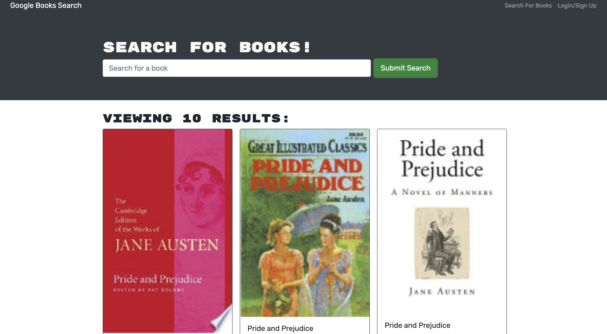
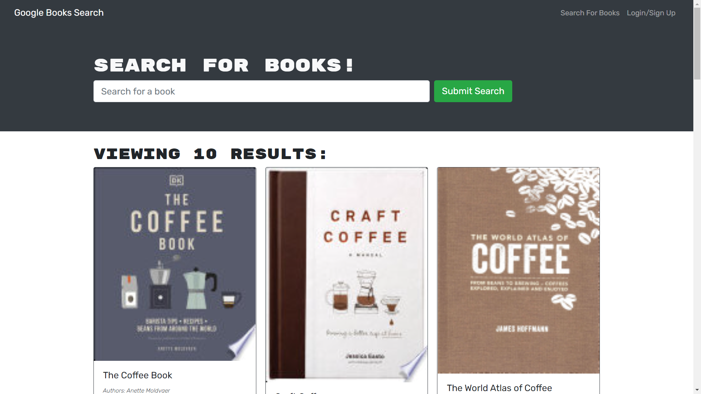

# Book Search Engine

## Overview

Book Search Engine is a web application that allows users to search for books using the Google Books API. The application, originally built with a RESTful API, has been refactored to incorporate a GraphQL API with Apollo Server. Developed with the MERN stack, the app features a React front end, MongoDB database, and Node.js/Express.js server and API.

## Features

- **Search Books:** Utilize the Google Books API to search for books.
- **User Authentication:** Log in or sign up to save and view personalized book lists.
- **Save and Remove Books:** Save books to your account and remove them as needed.

## Demo

View the live demo of the application: [https://booksengis.onrender.com/](#)

## Repository

GitHub Repository: [Repository Link](https://github.com/your-username/book-search-engine)

## Tech Stack

- React.js
- Node.js/Express.js
- MongoDB (Atlas for deployment)
- GraphQL (Apollo Server)

## Screenshots




## Getting Started

1. **Clone the repository.**
   ```bash
   git clone https://github.com/your-username/book-search-engine.git
   ```

2. **Install dependencies.**
   ```bash
   cd book-search-engine
   npm install
   ```

3. **Set up a MongoDB Atlas account and configure the connection string.**

4. **Refactor the back-end files and update the front-end files to integrate Apollo Server for GraphQL.**

## Usage

1. Enter a search term in the input field to search for books.
2. Save books to your account by clicking the "Save" button.
3. View your saved books and remove them if needed.

## Contributors

- [Basit Malik](https://github.com/basitmalik97)

